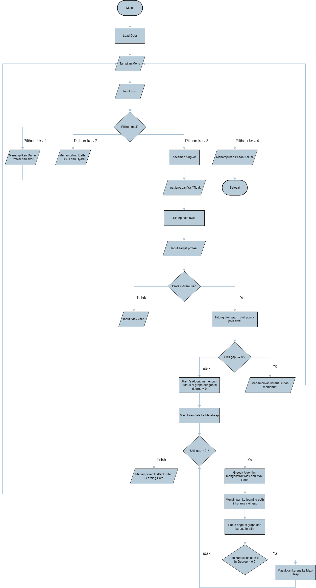

# 🚀 Re-Skill: Sistem Otomatisasi Transisi Karier (CLI)
> **Platform cerdas berbasis terminal C untuk memetakan ulang karier pekerja terdampak disrupsi Kecerdasan Buatan (AI).**


## 📌 Deskripsi Proyek
**Re-Skill** adalah sistem kalkulator transisi karier deterministik yang dirancang khusus untuk membantu pekerja terdampak Pemutusan Hubungan Kerja (PHK) akibat otomatisasi AI. Sistem ini memetakan keterampilan bawaan pengguna dan merumuskan jalur pembelajaran ulang (*reskilling*) yang paling efisien menuju profesi baru yang kebal terhadap otomatisasi.

Proyek ini merupakan bentuk kontribusi nyata terhadap **Sustainable Development Goals (SDGs) Nomor 8**: *Pekerjaan Layak dan Pertumbuhan Ekonomi*, dengan memastikan terciptanya tenaga kerja yang adaptif dan inklusif di era revolusi industri baru.

---

## 🛑 Masalah & 💡 Solusi

### 🚨 Masalah (The Problem)
* **Disrupsi AI:** Otomatisasi menghapus jutaan lapangan pekerjaan administratif dan teknis tingkat dasar.
* **Kesenjangan Keterampilan (*Skill Gap*):** Korban PHK sering kali memiliki keterampilan terpendam (*transferable skills*), namun kebingungan memetakan keterampilan tersebut ke profesi baru.
* **Pelatihan Tidak Efisien:** Program pelatihan massal sering kali memaksa pekerja belajar dari nol, membuang waktu dan biaya ekonomi.

### ✨ Solusi (The Solution)
**Re-Skill** hadir sebagai "Jaring Pengaman Karier" berbasis komputasi algoritmik. Melalui asesmen singkat, sistem mengkalkulasi modal *Skill Points* (SP) pengguna. Alih-alih mencocokkan secara pasif, Re-Skill menggunakan algoritma optimasi tingkat lanjut untuk menyusun kurikulum transisi karier tercepat, sehingga pengguna hanya perlu mempelajari materi yang menjadi kekurangan (gap) mereka saja.

---

## ⚙️ Pemilihan Struktur Data & Algoritma (SDA)
Sistem ini dibangun menggunakan arsitektur pemrosesan berlapis untuk memastikan optimasi *Big-O* yang maksimal, tanpa melibatkan *Machine Learning*:

1. **🌳 Binary Search Tree (BST) & Binary Search:** Digunakan sebagai basis data penyimpanan profil profesi. Memungkinkan pencarian target profesi dan syarat *Skill Points*-nya secara instan dengan kompleksitas waktu `O(log n)`.
2. **🕸️ Directed Acyclic Graph (DAG) & Kahn's Algorithm:** Digunakan untuk memodelkan hierarki prasyarat (*prerequisites*) antar-kursus. *Kahn's Algorithm* bertugas mengurai *In-Degree* node untuk memastikan logika urutan belajar yang tidak menyesatkan.
3. **⛰️ Max-Heap & Greedy Algorithm:** Bertindak sebagai mesin optimasi utama. *Greedy* akan mengekstrak nilai SP terbesar dari antrean *Max-Heap* pada setiap iterasinya, memastikan pengguna mencapai target profesi dengan jumlah pengambilan kursus sesedikit mungkin.

---

## 🔄 Alur Sistem (System Flow)

Aplikasi beroperasi melalui *Command Line Interface* (CLI) dengan alur interaksi sebagai berikut:

1. **Inisialisasi & Menu:** Sistem memuat *dummy data* (Profesi ke BST, Kursus ke Graph) dan menampilkan opsi menu interaktif.
2. **Asesmen Keterampilan Dasar:** Pengguna menjawab 5 pertanyaan *Yes/No* fundamental era AI untuk menghitung "Poin Bawaan".
3. **Validasi Target:** Pengguna menginput profesi tujuan. Sistem mencarinya di BST dan menghitung selisih poin (*Skill Gap*).
4. **Optimasi Reskilling (Core Engine):** * Sistem mengidentifikasi kursus tanpa prasyarat di *Graph* dan memasukkannya ke *Max-Heap*.
   * Menggunakan *Greedy*, sistem mengambil kursus berpoin terbesar, menyimpannya ke *Learning Path*, lalu membuka kunci kursus lanjutan di *Graph*.
   * Diulang hingga *Skill Gap* terpenuhi.
5. **Output Akhir:** Cetak daftar urutan *Learning Path* yang personal dan efisien ke layar terminal.

### 📊 Diagram Alur (Bagan Draw.io)
*(Note: Bagan alur ini dirancang menggunakan Draw.io dan ditampilkan sebagai file gambar.)*



👥 Tim pengembang proyek ini dikembangkan untuk memenuhi Praktikum Struktur Data & Algoritma, Universitas Syiah Kuala (2026).
| Nama | NIM | Role / Jobdesc |
| :--- | :--- | :--- |
| **Muhammad Aqil Mubarak** | `250810701100003` | System Architecture & Documentation |
| **Muhammad Rauyan** | `250810701100048` | Presentation & Logic Design |
| **Faiz Asra** | `250810701100062` | Data Structure Implementation |
| **Mohd Rian Maulana** | `250810701100082` | Algorithm Optimization |

🛠️ Cara Menjalankan Program (How to Run)
Pastikan Anda memiliki compiler C yang terinstal di sistem operasi Anda.
Clone repositori ini: 
```
Bashgit clone [https://github.com/username-kalian/RE-SKILL-SISTEM-OTOMATISASI-TRANSISI-KARIER.git](https://github.com/username-kalian/RE-SKILL-SISTEM-OTOMATISASI-TRANSISI-KARIER.git)
```
Lakukan kompilasi source code utama:
```
Bashgcc main.c -o reskill
```
Jalankan program via terminal:
```
Bash./reskill
```
